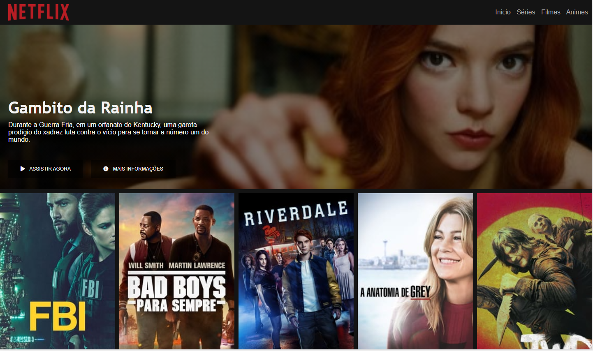
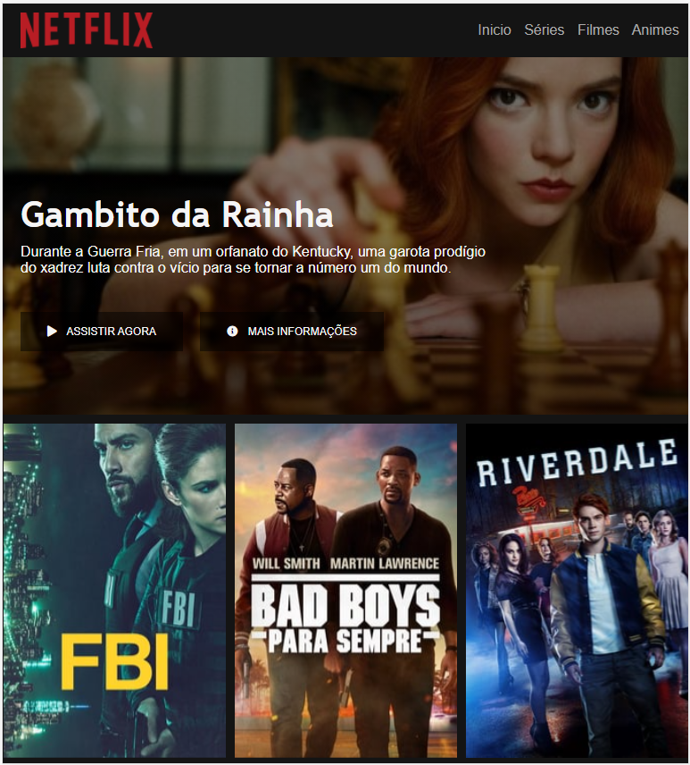

<h1 align="center">
    
    
Netflix

    
    
</h1>

## Sobre o Projeto 

O projeto consiste em refazer a Interface da Netflix fixar os conceitos de html e css.

## Layouts

    
    
    

## 🛠 Tecnologias

As seguintes ferramentas foram usadas na construção do projeto:

- [HTML](https://www.w3.org/html/)
- [CSS](https://www.w3.org/Style/CSS/)

## Autor

Jefferson D'Antonio Malaquias 

 

 
